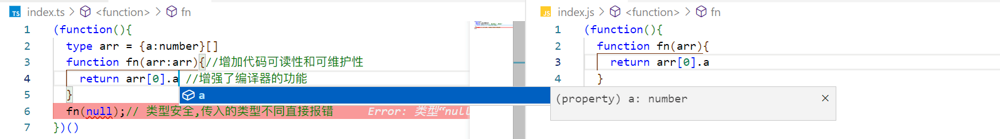

## TypeScript类型体操
<!-- (https://jkchao.github.io/typescript-book-chinese/) -->

### TypeScript是什么,为什么要使用TypeScript?
1. 类型安全
2. 增加代码可读性和可维护性
3. 增强了编译器的功能


### TypeScript类型体操学习前置知识
1. type  类型别名  可以自定义类型也可以给原有类型命名
```ts
type reString = string;
type obj = {};
```
2. interface  接口  可以描述函数、对象、构造器的结构
```ts
interface obj{
  a: number,
  b: string
}
let testObj:obj = {
  a: 1,
  b: '1'
}
```
3. 泛型  可以让我们对类型进行复用
```ts
// function fn(args){
//   return args
// }
function fn<T>(args:T):T{
  return args
}
```
4. extends  约束类型  对类型进行约束
```ts
function fn<T extends string>(args:T):T{
  return args
}
```
5. extends ? :  条件类型  相当于js中的三元运算符
```ts
type is = 1 extends 1 ? true : false;
```
6. infer  类型推断  只能在条件语句的extends中使用，来进行类型的推断
```ts
type Parameters<T extends (...args: any) => any> = T extends (...args: infer P) => any ? P : never;
```
7. as <>  类型断言  当你比程序更加明白是什么类型的时候使用
```ts
let foo: any;
let bar = <string>foo; // 现在 bar 的类型是 'string'
let bar2 = foo as string;
```
8. typeof   typeof是获取变量的类型
```ts
let n = 1;
type test = typeof n;//test 是 number 类型
```
9. keyof   keyof是获取索引类型的属性名，并构造成联合类型
```ts
type obj = {
  a: '1',
  b: 1
}
type test = keyof obj;
let a:test = 'a'
let b:test = 'b'
```

### TypeScript类型体操口诀

模式匹配做提取，重新构造做变换。

递归复用做循环，数组长度做计数。

联合分散可简化，特殊特性要记清。

基础扎实套路熟，类型体操可通关。

### 匹配模式做提取
1. 数组类型

- 提取数组第一个元素的类型⭐
```ts
type GetFirst<Arr extends unknown[]> = Arr extends [infer First, ...unknown[]] ? First : never;
type arr = [undefined,number,string];
type test = GetFirst<arr>;
```

- 提取数组的最后一个元素的类型
```ts
type GetLast<Arr extends unknown[]> = Arr extends [...unknown[],infer Last] ? Last : never;
type arr = [undefined,number,string];
type test = GetLast<arr>;
```

- 去掉数组最后一个元素的类型
```ts
type PopArr<Arr extends unknown[]> = Arr extends [] ? [] : Arr extends [...infer Result,unknown] ? Result : never;
type arr = [undefined,number,string];
type test = PopArr<arr>;
```

- 去掉数组第一个元素的类型
```ts
type ShiftArr<Arr extends unknown[]> = Arr extends [] ? [] : Arr extends [unknown,...infer Result] ? Result : never;
type arr = [undefined,number,string];
type test = ShiftArr<arr>;
```

2. 字符串类型

- 判断字符串是否以某个前缀开始
```ts
type StartWith<Str extends string, Start extends string> = Str extends `${Start}${string}` ? true : false;
type test = StartWith<'123','1'>
```

- 字符串替换⭐
```ts
type ReplaceStr<
  Str extends string,
  From extends string,
  To extends string
> = Str extends `${infer Prefix}${From}${infer Suffix}` ?
    ReplaceStr<`${Prefix}${To}${Suffix}`,From,To> : Str
type test = ReplaceStr<'1231','1'>
```

- 递归去除字符串中的右侧空格
```ts
type TrimStringRight<Str extends string> = Str extends `${infer Result}${' '}` ? TrimStringRight<Result> : Str;
type test = TrimStringRight<'   123   '>
```

- 递归去除字符串中的左侧空格
```ts
type TrimStringLeft<Str extends string> = Str extends `${' '}${infer Result}` ? TrimStringLeft<Result> : Str;
type test = TrimStringLeft<'   123   '>
```

- 递归去除字符串中的左右侧空格⭐
```ts
type StrTrim<Str extends string> = 
  Str extends `${' '}${infer Right}` ? StrTrim<Right> : 
  Str extends `${infer Left}${' '}` ?  StrTrim<Left> : Str
type test = StrTrim<'   111      '>
```

3. 函数

- 提取参数的类型
```ts
type FunctionArgs<Fn extends Function> = Fn extends (...args:infer Args) => unknown ? Args : never;
```

- 提取返回值
```ts
type FunctionResult<Fn extends Function> = Fn extends (...args:any[]) => infer Result ? Result : never;
```

- 提取函数中的this
```ts
type FunctionThis<Fn extends Function> = Fn extends (this:infer This,...args:unknown[])=>unknown ? This : never;
```

### 重新构造做变换
1. 数组类型的重新构造

- 向数组后面添加元素
```ts
type Push<Arr extends unknown[],Ele> = [...Arr,Ele];
```

- 向数组前面添加元素
```ts
type Shift<Ele, Arr extends unknown[]> = [Ele,...Arr];
```

- 合并只有两个元素的两个元组对应的元素
```ts
// [1,2] ['a1','a2'] => [[1,'a1'],[2,'a2']]
type Concat<One extends [unknown,unknown],Two extends [unknown,unknown]> = 
  One extends [infer OneFirst, infer OneSecond] ?
    Two extends [infer TwoFirst, infer TwoSecond] ? [[OneFirst,TwoSecond],[OneSecond,TwoFirst]] : []
  : []
  type test = Concat<[1,2],['a1','a2']>;
```

- 合并有任意个元素的两个元组对应的元素⭐
```ts
// [1,2,3,4,5] ['a1','a2','a3','a4','a5'] => [[1, "a1"], [2, "a2"], [3, "a3"], [4, "a4"], [5, "a5"]]
type Concat2<One extends unknown[], Second extends unknown[]> = 
  One extends [infer OneFirst,...infer OneEnd] ?
    Second extends [infer TwoFirst,...infer TwoEnd] ? [[OneFirst,TwoFirst],...Concat2<OneEnd,TwoEnd>] : []
  : []
type test = Concat2<[1,2,3,4,5],['a1','a2','a3','a4','a5']>
```

2. 字符串的重新构造

- 将字符串第一个元素转换成大写
```ts
type StringFistToUp<Str extends string> = Str extends `${infer First}${infer Other}` ? `${Uppercase<First>}${Other}` : never
```

- 删除字符串中的某个字串
```ts
type DeleteString<Str extends string,Ele extends string> = 
Str extends `${infer Start}${Ele}${infer End}` ? DeleteString<`${Start}${End}`,Ele> : Str
```

- 函数类型的重新构造
```ts
type FunAddParam<Fn extends Function,Arg extends unknown> =
Fn extends (...args:infer Args)=>infer Result ? (...args:[...Args,Arg])=>Result : never
```

3. 索引类型重新构造

- 把索引类型的Key变成大写⭐
```ts
type KeyUp<Obj extends Object> = {[Key in keyof Obj as Uppercase<Key & string>]:Obj[Key]}
type test = UpKey<{
  a: number,
  b: string
}>
```

- Record，typescript内置了Record，用来创建索引类型。⭐
```ts
type _Record<K extends keyof any, T> = {[P in K]: T}
```

- 将索引转换成只读
```ts
type ReadonlyParam<T> = {
 readonly  [P in keyof T]: T[P]
}
```

- 给索引添加可选修饰符
```ts
type toSelector<T> = {
  [P in keyof T]?: T[P]
}
```

- 去掉只读修饰符
```ts
type RemoveReadonly<T> = {
  -readonly [P in keyof T]: T[P]
}
```

- 去掉可选修饰符
```ts
type ClearSelector<T> = {
  [P in keyof T]-?: T[P]
}
```

- 对索引类型做过滤⭐
```ts
type FilterValue<T extends Record<string,any>,valueType extends unknown> = {
  [Key in keyof T as T[Key] extends valueType ? Key : never]: T[Key]
}
type test = Filter<{a:string,b:number},string>
```

### 递归复用做循环
1. Promise的递归调用

- 提取不确定层数的Promise中的value类型的高级类型
```ts
type PromiseValue<T> = 
T extends Promise<infer Value>?
  PromiseValue<Value>
: T
type promise = PromiseValue<Promise<Promise<Record<string,any>>>>
```

2. 数组类型的递归

- 不确定长度的元组反转⭐
```ts
type ReverseArr<T extends Array<unknown>> = T extends [infer First,...infer Other] ? [...ReverseArr<Other>,First] : T;
```

- 寻找元组中是否存在某个元素
```ts
type IsEqual<A,B> = (A extends B ? true : false) & (B extends A ? true : false);
type Include<Arr extends unknown[],Ele> = 
Arr extends [infer First,...infer Other] ?
  IsEqual<First,Ele> extends true ? true : Include<Other,Ele>
: false;
```

- 删除元组中的某个元素
```ts
type RemoveArrItem<
  Arr extends unknown[],
  Item,
  Result extends unknown[] = []
> = Arr extends [infer First,...infer Other] ?
  IsEqual<Item,First> extends true ? RemoveArrItem<Other,Item,Result> : RemoveArrItem<Other,Item,[...Result,First]>
: Result
type IsEqual<A,B> = (A extends B ? true : false) & (B extends A ? true : false)
```

- 构建一个自定义长度的同一类别的数组⭐
```ts
type BuildArr<
  Length extends number,
  Ele,
  Arr extends unknown[] = []
> = Arr['length'] extends Length ? Arr : BuildArr<Length,Ele,[...Arr,Ele]>
```

3. 字符串类型的递归

- 将字符串中的所用的指定字串替换成另一个字符串
```ts
type Replace<
  Str extends string,
  From extends string,
  To extends string
> = Str extends `${infer Start}${From}${infer End}` ? Replace<`${Start}${To}${End}`,From,To> : Str
```

- 将字符串的每个元素提取出来转换成联合类型
```ts
type StrType<Str extends string,Result = never> = Str extends `${infer First}${infer Other}` ? StrType<Other,Result|First> : Result
```

- 反转字符串类型
```ts
type ReverseString<Str extends string,Result extends string = ""> = Str extends `${infer First}${infer Other}` ? ReverseString<Other,`${Result}${First}`> : Result
```

4. 对象类型的递归(索引类型的递归)

-递归将所有层的索引都变成只读
错误代码，如果测试一下我们就会发现，递归没有进行下去。因为ts的类型只有被用到的时候才会被计算。这里只是给第一次的索引加上了只读，但是没有使用。所以不会进行计算，我们可以加一个Obj extends any让其计算。
```ts
type DeepReadonly<Obj extends Record<string,any>> = Obj extends any ? {
  readonly [Key in keyof Obj]: Obj[Key] extends Record<string,any> ? 
    Obj[Key] extends Function ? Obj[Key] : DeepReadonly<Obj[Key]>
  : Obj[Key]
} : never
```

### 数组长度做计算
1. 数组长度实现加减乘除

- 加⭐
```ts
type BuildArray<
  Length extends number,
  Ele = unknown,
  Result extends unknown[] = []
> = Result['length'] extends Length ? Result : BuildArray<Length,Ele,[Ele,...Result]>
type Add<Arr extends unknown[],Result extends unknown[] = []> = Arr extends [infer Start extends number,...infer Other]
                                                          ? Add<Other,[...BuildArray<Start>,...Result]> : 
                                                          Result['length']
type s = Add<[1,2,3]>
```

- 减⭐
```ts
type BuildArray<
  Length extends number,
  Ele = unknown,
  Result extends unknown[] = []
> = Result['length'] extends Length ? Result : BuildArray<Length,Ele,[Ele,...Result]>
type SubTract<Num1 extends number,Num2 extends number> = BuildArray<Num1> extends [...BuildArray<Num2>,...infer Result] ? Result['length'] : never
```

- 乘
```ts
type BuildArray<
  Length extends number,
  Ele = unknown,
  Result extends unknown[] = []
> = Result['length'] extends Length ? Result : BuildArray<Length,Ele,[Ele,...Result]>
type SubTract<Num1 extends number,Num2 extends number> = BuildArray<Num1> extends [...BuildArray<Num2>,...infer Result] ? Result['length'] : never
type Multiply<
  Num1 extends number,
  Num2 extends number,
  Result extends unknown[] = []
> = Num1 extends 0 ? Result['length'] : Multiply<SubTract<Num1,1>,Num2,[...Result,...BuildArray<Num2>]>
```

- 除
```ts
type BuildArray<
  Length extends number,
  Ele = unknown,
  Arr extends unknown[] = []
> = Arr['length'] extends Length ?
    Arr :
    BuildArray<Length,Ele,[...Arr,Ele]>
type Subtract<Num1 extends number, Num2 extends number> = BuildArray<Num1> extends [...arr1: BuildArray<Num2>, ...arr2: infer Rest] ?
Rest['length'] : never
type Divide<
  Num1 extends number,
  Num2 extends number,
  ResultArr extends unknown[] = []
> = Num1 extends 0 ?
    ResultArr['length'] :
    Divide<Subtract<Num1,Num2>,Num2,[unknown, ...ResultArr]>;
type divide = Divide<6,3>;
```

- 求字符串的长度的类型
```ts
type StrLen<
  Str extends string,
  ResultArr extends unknown[] = []
> = Str extends `${string}${infer Rest}`? 
  StrLen<Rest,[...ResultArr, unknown]>
: ResultArr['length'];
type str = StrLen<'123'>;
```

- 比较两个值的大小
```ts
type Than<
  Num1 extends number,
  Num2 extends number,
  Count extends unknown[] = []
> = Num1 extends Num2 ? false :
  Count['length'] extends Num2 ? true :
  Count['length'] extends Num1 ? false :
  Than<Num1,Num2,[unknown,...Count]>
```

- Fibonacci 数列的计算
```ts
type Fi<
  Left extends unknown[],
  Right extends unknown[],
  Num extends number,
  Idx extends unknown[] = [],
  > = Idx['length'] extends Num ? Right['length'] : Fi<Right,[...Left,...Right],Num,[...Idx,unknown]>
type Fib<Num extends number> = Fi<[],[1],Num,[1]>
```

### 联合分散可化简
1. 将联合类型的字符串_去点，并将_后的第一个字母大写⭐
```ts
type Tool<Str extends string> = Str extends `${infer First}_${infer Start}${infer End}` ? Tool<`${First}${Uppercase<Start>}${End}`> : Str
type item = Tool<'aa_aa_aa_aa'>;
type item2 = Tool<'aa_aa_aa_aa','bb_bb_bb_bb'>
```

2. 判断联合类型⭐
特性，如果extends左边是联合类型会将每个类型单独传入，而右边不会。
```ts
type TestUnion<A, B = A> = A  extends A ? { a: A, b: B} : never;

type TestUnionResult = TestUnion<'a' | 'b' | 'c'>;
```
```ts
type Tool<A, B = A> =
A extends A?
  [B] extends [A] ? false : true
: never
```

3. BEM
BEM是css命名规范
```yarm
type bemResult = BEM<'guang', ['aaa', 'bbb'], ['warning', 'success']>;
//会转换成
guang__aaa--warning guang__bbb--success
```

```ts
type BEM<Ele1 extends string,Ele2 extends string[],Ele3 extends string[]> = `${Ele1}__${Ele2[number]}--${Ele3[number]}`
```

4. AllCombinations
```ts
type Combination<A extends string, B extends string> =
    | A
    | B
    | `${A}${B}`
    | `${B}${A}`;
type AllCombinations<A extends string, B extends string = A> = 
A extends A
    ? Combination<A, AllCombinations<Exclude<B, A>>>
    : never;
type all = AllCombinations<'A' | 'B' | 'C'>;
```

### 特殊类型要记清
1. IsEqual
```ts
type IsEqual<A,B> = (<T>()=>T extends A ? 1 : 2) extends (<T>()=>T extends B ? 1 : 2) ? true : false
```

2. 几个条件类型的特殊情况

- 联合类型作为类型参数在条件类型左边的时候，会把每个类型单独传入做计算，并把结果合并成联合类型。
```ts
type Test<T> = T extends number ? 1 : 2;
type res = Test<1 | 'a'>;//type res = 1 | 2
```

- boolean也是联合类型，是false | true。
```ts
type Test<T> = T extends true ? 1 : 2;
type res = Test<boolean>;//type res = 1 | 2
```

- any类型如果在条件类型的左边，则返回trueType和falseType的联合类型。
```ts
type Test<T> = T extends true ? 1 : 2;
type res = Test<any>;//type res = 1 | 2
```

- 当条件类型的左侧是never的时候直接返回never。
```ts
type Test<T> = T extends true ? 1 : 2;
type res = Test<never>;//type res = never
```